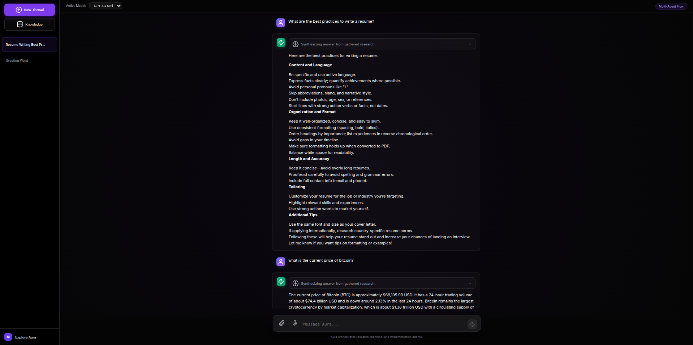

# Aura: Autonomous Multi-Agent RAG System

Aura is a premium, autonomous multi-agent RAG system designed for high-performance reasoning, content generation, and knowledge synthesis. Built with **LangGraph**, **FastAPI**, and **Redis Stack**, it orchestrates specialized agents to solve complex tasks with transparency and efficiency.

## 🚀 Key Features

*   **Autonomous Orchestration**: Uses LangGraph to manage a sophisticated multi-agent workflow (Researcher, Planner, Coder, Responder).
*   **Intelligent Caching**: High-performance caching layer powered by **Redis Stack** with:
    *   **Research Caching**: Skips redundant web searches.
    *   **Vector Caching**: Accelerates repeated knowledge base queries.
    *   **Response Caching**: Instant answers for identical request contexts.
    *   **Auto-Invalidation**: Caches automatically synchronize when the Knowledge Base is updated.
*   **Premium UX/UI**:
    *   **Thought Transparency**: Expandable thought bubbles reveal the agent's internal reasoning and implementation details.
    *   **Compact Design**: Optimized for 15-inch displays with professional dark mode aesthetics.
    *   **Live Stream**: Real-time agent progress updates via SSE (Server-Sent Events).
*   **Robust Memory**:
    *   **Short-term**: Context-aware windowing of recent conversation history.
    *   **Long-term**: Persistent session storage in **PostgreSQL**.
*   **Multimodal Capabilities**: Native support for text, images, and documents.
*   **Enterprise Analytics**:
    -   **Cost Analytics**: Persistent tracking of token usage and costs per model in PostgreSQL.
    -   **Optimized History**: Efficient history pagination for large-scale production use.

## 🛠 Architecture

The system follows a star-pattern orchestration:
1.  **Router**: The Lead Orchestrator that analyzes user intent and routes to specialized agents.
2.  **Researcher**: Performs deep-dives into the internal Knowledge Base (ChromaDB) and the Web (Google/Tavily).
3.  **Planner**: Synthesizes research into strategic, step-by-step execution roadmaps.
4.  **Coder**: Implements plans with Python execution capabilities for verification.
5.  **Responder**: Synthesizes all agent outputs into a polished, user-facing response.

## 📸 User Interface

<p align="center">
  
</p>

*The premium dark-mode interface features real-time agent thoughts, conversation threading, and knowledge base management.*

## 📥 Getting Started

### Prerequisites
- Docker & Docker Compose
- OpenAI API Key (or Gemini via configuration)

### Deployment (Docker)
1.  **Configure Environment**:
    The system uses branch-aware environment files. You should create the appropriate file based on your environment:
    *   **Development**: `.env.dev`
    *   **Staging**: `.env.staging`
    *   **Production**: `.env.prod`

    The app automatically picks the correct file:
    ```bash
    cp .env.example .env.dev  # For local development
    ```
    Ensure essential keys are set: `OPENAI_API_KEY`, `TAVILY_API_KEY`, and `APPLICATION_API_KEY`.
2.  **Start the System**:
    ```bash
    docker compose up --build
    ```
    Access the UI at `http://localhost:8777`.

## 📚 API Endpoints

| Endpoint | Method | Description |
| :--- | :--- | :--- |
| `/chat/stream` | POST | Stream AI response with real-time agent thoughts. |
| `/chat` | POST | Synchronous chat interaction. |
| `/sessions` | GET | List all conversation threads with pagination. |
| `/knowledge/upload`| POST | Upload files to the Knowledge Base. |
| `/knowledge/list` | GET | List indexed documents. |
| `/costs/models` | GET | Retrieve per-model token usage and cost analytics. |
| `/cache/stats` | GET | Audit cache hit/miss performance. |

---
